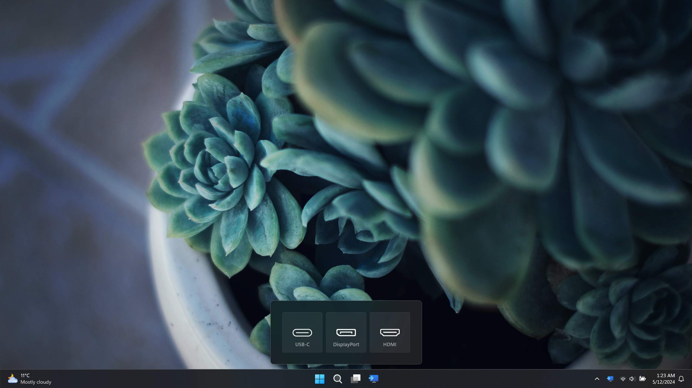

# Input Switcher

Welcome to the official issue-only repo of Input Switcher. This app allows you to change video input sources for all monitors connected to your PC or docking station with a single click.
ℹ️ Make sure your monitors support DDC/CI features (such as changing contrast, volume or power state).

  

  

Feel free to share ideas about new features or report bugs.